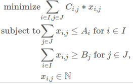

# Latex2AMPL
It converts a Linear/Nonlinear/Constraint Programming Model written in LaTeX to an AMPL Code.

<a href='http://ampl.com/products/ampl/' target='ampl_system'>AMPL system</a> is a tool for <i>"the entire optimization modeling lifecycle"</i>. It is available as an IDE and a command line tool. AMPL is also the name of the modeling language used in this tool. More information about this tool and its language are available in the book <a href='http://ampl.com/resources/the-ampl-book/chapter-downloads/' target='ampl_book'>AMPL: A Modeling Language for Mathematical Programming</a> that you can download for free.

AMPL supports the main solvers in the market, like Xpress, CPLEX and Minos, as well as open source solvers, like CBC, Couenne and Geocode. A list of all solvers supported by AMPL is found <a href='http://ampl.com/products/solvers/all-solvers-for-ampl/' target='ampl_solvers'>here</a>. You can download a free size-limited version for students <a href='http://ampl.com/try-ampl/download-a-free-demo/' target='ampl_free'>here</a>.

Check <a href='https://latex2ampl.herokuapp.com' target='_blank'>https://latex2ampl.herokuapp.com</a> to see <b>latex2ampl</b> working.

Consider, as an example, the following Linear Program.

<p align="center"> 

</p>

The LaTex code that generated it is

```latex
\begin{equation}
\begin{split}
  \text{minimize} & \displaystyle\sum\limits_{i \in I,j \in J}C_{i,j} * x_{i,j}\\
  \text{subject to} & \displaystyle\sum\limits_{j \in J}x_{i,j} \leq A_{i} \text{ for } i \in I\\
  & \displaystyle\sum\limits_{i \in I}x_{i,j} \geq B_{j} \text{ for } j \in J,\\
  & x_{i,j} \in \mathbb{N}
\end{split}
\end{equation}
```

<b>latex2ampl</b> converts the LaTex code above to the following AMPL code

```ampl
set I;

set J;

param A{i in I};

param C{i in I, j in J};

param B{j in J};


var x{i in I, j in J} integer >= 0;


minimize obj: sum{i in I, j in J}C[i,j] * x[i,j];

s.t. C1 {i in I} :
	sum{j in J}x[i,j] <= A[i];

s.t. C2 {j in J} :
	sum{i in I}x[i,j] >= B[j];
```

The Inference Mechanism is used to define if an identifier is a set, parameter or variable. This mechanism is explained in the <b>Inference Mechanism</b> section.


> In the remaining of this article you will see terms, like Indexing Expression, Numeric Expression and others, that are not fully explained here. Please, refer to <a href='http://ampl.com/resources/the-ampl-book/chapter-downloads/' target='ampl_book'>AMPL: A Modeling Language for Mathematical Programming</a> to see their meanings.


# Objective Statements

A Linear Program written in LaTex code can have one or more objectives. A <b>Objective</b> statement must begin with one of the following: `\text{maximize}`, `\text{maximize:}`, `maximize`, `maximize:`, `\text{minimize}`, `\text{minimize:}`, `minimize` or `minimize:`. In a AMPL code, the first objective statement is the main objective, i.e., it is the one to be optimized, the others are secondaries.

For instance, <b>latex2ampl</b> converts

```latex
\text{minimize} \sum_{i \in I,j \in J}C_{i,j} * x_{i,j}
```

to 

```ampl
minimize obj: sum{i in I, j in J}C[i,j] * x[i,j];
```

Formal definition of the Objective statement is given in <b>Statements and Expressions</b> section.


# Constraint and Declaration Statements

<b>Constraint</b> and <b>Declaration</b> statements are defined formally in <b>Statements and Expressions</b> section.

As an example, 

```latex
\sum_{j \in J}x_{i,j} \leq A_{i}: i \in I\\
\sum_{i \in I}x_{i,j} \geq B_{j}: j \in J\\
```

is converted to

```ampl
s.t. C1 {i in I} :
	sum{j in J}x[i,j] <= A[i];

s.t. C2 {j in J} :
	sum{i in I}x[i,j] >= B[j];
```

## Constraint Statements

The LaTex code below illustrates how Constraints can be expressed

```latex
\sum_{j \in J}x_{i,j} \leq A_{i}: i \in I\\
\sum_{i \in I}x_{i,j} \geq B_{j}: j \in J\\
0 \leq \sum_{j \in J}x_{i,j} \leq 100: i \in I\\
1000 \geq \sum_{i \in I}x_{i,j} \geq 0: j \in J\\
C_{i} = 1: i \in I\\
```

It is converted to

```ampl
s.t. C1 {i in I} :
	sum{j in J}x[i,j] <= A[i];

s.t. C2 {j in J} :
	sum{i in I}x[i,j] >= B[j];

s.t. C3 {i in I} :
	0 <= sum{j in J}x[i,j] <= 100;

s.t. C4 {j in J} :
	1000 >= sum{i in I}x[i,j] >= 0;

s.t. C5 {i in I} :
	C[i] = 1;
```

## Declaration Statements

Declarations are used to declare the attributes of an identifier. For instance

```latex
m, n \in \mathbb{Z}, \in \mathbb{P}, > 0; J := 1 \ldots n; M := 1 \ldots m\\
```

is converted to

```ampl
param m integer, > 0;

param n integer, > 0;

set J, := 1..n;

set M, := 1..m;
```

Note that Declarations inside a statement can be separated by `;`. Each Declaration can have its own Indexing Expression. For declarations separated by `;`, the last Indexing Expression is used to infer the domains of identifiers that do not have its own Indexing Expression declared. For instance, consider the example below

```latex
x_{i} \in \mathbb{Z}; A_{i} \text{default} 0: i \in I
```

It is converted to

```ampl
param A{i in I}, default 0;

var x{i in I} integer;
```

Here, the Indexing Expression `i in I` is used for the identifiers `A` and `x`.

Note also the expression `\in \mathbb{P}`. It defines the identifiers `m` and `n` as parameters. When it is not explicitly defined (and at most cases it is indeed not necessary), <b>latex2ampl</b> uses its Inference Mechanism to define the type of an identifier: set, parameter or variable.

The attributes that can be defined for an identifier are given in <b>Declaration Attributes</b> section.


# Variables, Parameters and Sets

A variable must be member of one of the following sets: `\mathbb{B}` or `\{0,1\}` for binary numbers, `\mathbb{R}` or `\mathbb{R}^{+}` for real numbers, `\mathbb{Z}` or `\mathbb{Z}^{+}` for integer numbers and `\mathbb{N}` for natural numbers. Additionally, in order to declare an identifier as a variable you can make this identifier member of one of the following sets: `\mathbb{V}`, `\mathbb{Var}`, `\mathbb{Vars}`, `\mathbb{Variable}` or `\mathbb{Variables}`. Ex.: `x \in \mathbb{V}`.

In order to declare an identifier as a parameter you can make this identifier member of one of the following sets: `\mathbb{P}`, `\mathbb{Param}`, `\mathbb{Params}`, `\mathbb{Parameter}` and `\mathbb{Parameters}`. Ex.: `D \in \mathbb{P}`. At most cases, the Inference Mechanism is capable of correctly inferring the identifiers that are parameters. This explicit definition is useful when you want to declare that a parameter is an integer, natural or real number, like in `P \in \mathbb{Z}`. In this example, the rule in previous paragraph is applied and `P` is considered a variable, unless explicitly stated that it is a parameter. For instance, `P \in \mathbb{Z}, P \in \mathbb{Param}`.
 
In order to declare an identifier as a set you can make this identifier member of one of the following sets: `\mathbb{Set}` and `\mathbb{Sets}`. Ex.: `A \in \mathbb{Set}`. At most cases, the Inference Mechanism is capable of correctly inferring the identifiers that are sets.


A Symbolic Parameter is used for parameters that are Symbolic Expressions. For instance, strings. It must be member of `\mathbb{S}`. Ex.: `sym \in \mathbb{S}`.

Below, an example of a symbolic parameter.

```latex
sym \in \mathbb{S}, := "test"
```

It is converted to

```ampl
param sym symbolic, := "test";
```

A Logical Parameter is used for parameters that are Logical Expressions. It must be member of `\mathbb{L}`. Ex.: `logic \in \mathbb{L}`. 

Logical parameters are useful to use in conditional expressions. For instance, 

```latex
L \in \mathbb{S}\\
P := (L)? 1 : 0\\
```

is converted to

```ampl
param L symbolic;
param P, := if L then 1 else 0;
```

If `L` was not of the type `param logical`, the second line in the AMPL code above would result in an error thrown by a AMPL solver.

A ordered set is declared using `\mathbb{O}`. For instance,

```latex
ordSet \in \mathbb{O}
```

is converted to

```ampl
set ordSet ordered;
```

A circular set is declared using `\mathbb{C}`. For instance,

```latex
circSet \in \mathbb{C}
```

is converted to

```ampl
set circSet circular;
```


# Notation

> Any word inside a `\text{ }` can have several whitespaces between the braces, to the left or to the right of the word. For instance, `\text{default}` can also be `\text{ default }`, `\text{ default}`, `\text{default }`, and so on.

## Identifiers

An identifier is formed by characters in `a-z`, `A-Z` or `0-9` and optional `\_` (one or more, in any position). It can start with `\_` or characters in `a-z` or `A-Z`, and can have size one or more. If the identifier starts with one or more `\_`, then at least one character in `a-z` or `A-Z` must follow the initial sequence of `\_`.

Example:

```latex
\_id1 := "test"
```
is converted to

```ampl
param _id1, := "test";
```

Note that `_` alone is not allowed in an identifier, because `_` is used in LaTeX to format text. Therefore, if you need an identifier with underscore(s) you must write each underscore as `\_`.

An Identifier inside a `\text` is also an Identifier. For instance

```latex
\text{a} := \text{\_for}
```

is converted to

```ampl
param _for;
param a, := _for;
```

## Numbers

Numbers can be expressed using `.` as the decimal point. It is also possible to use `E`, `e`, `+` or `-` to the exponential part, like in `123.5E-10`. Furthermore, numbers can start with `+` or `-`, like in `-67.3`. The symbol for infinity `\infty` is recognized as a number and can appear in any place where a number can appear. For instance:

```latex
-\infty \leq x \leq \infty
```

is converted to

```ampl
s.t. C1  : -Infinity <= x <= Infinity;
```

## Fractional Expressions

Fractional Expressions can be expressed as 

`\frac{` \<Numerator\> `}{` \<Denominator\> `}`,

where \<Numerator\> and \<Denominator\> are \<NumericExpression\> or \<Identifier\>. For instance, 

```latex
a := \frac{b+1}{c-1}
```

is converted to

```ampl
param c;
param b;

param a, := (b + 1)/(c - 1);
```


## Strings

| Math      | Latex   | Example   |
|-----------|---------|-----------|
| string    | `""` or `''` | `"Hello, wold!"` |
| string concatenator   | `\&` | `"Hello, " \& 'wold!'` |


## Reserved Words and Tokens

All reserved words can also be written inside a `\text`. For instance, both `for` and `\text{for}` are recognized as the token FOR.

| | | | |
|---------|--------|--------|-----------|
| `card`  | `length` | `round` | `trunc` |
| `precision` | `substr` | `sprintf` | `sub` | 
| `gsub` | `match` | `ichar` | `char` |
| `ctime` | `time` | `num` | `num0` |
| `alias` | `Irand224` | `Uniform01` | `Uniform` | 
| `Normal01` | `Normal` | `Beta` | `Cauchy` |
| `Exponential` | `Gamma` | `Poisson` | `maximize` | 
| `maximize:` | `minimize` | `minimize:` | `if` | 
| `then` | `else` | `by` | `div` | 
| `less` | `for` | `where` | `or` | 
| `and` | `default` | `dimen` | `setof` | 
| `count` | `atmost` | `atleast` | `exactly` | 
| `numberof` | `alldiff` |  | |


## Arithmetic Notation

| Math      | Latex                         | Example      |
|-----------|-------------------------------|--------------|
| addition  | `+`  | `2 + 3` |
| subtraction  | `-`  | `2 - 3` |
| less (positive difference) | `\text{less}`  | `2 \text{less} 3 = 0` |
| multiplication  | `*`, `\cdot` or `\ast` | `2 * 3` |
| division  | `/` or `\div` | `4/2 = 2` |
| exact quotient | `\big/`, `\text{div}` | `5 \text{div} 3 = 1` |
| remainder | `\text\{%}`, `\mod` or `\bmod` | `5 \mod 3 = 2` |


## Logic Notation

| Math      | Latex                         | Example      |
|-----------|-------------------------------|--------------|
| and       | `\land`, `\wedge` or `\text{and}` | `a = 1 \land b = 1` |
| or        | `\lor`, `\vee` or `\text{or}` | `a = 1 \lor b = 1` |
| not       | `\neg`, `!` or `\text{not}`       | `\neg b` | 
| exists    | `\exists` | `\exists \{i \in I\} z[i]` |
| not exists  | `\nexists` or `\not\exists` | `\nexists \{i \in I\} z[i]` |
| for all    | `\forall` | `\forall \{u \in unit\} u \in mPos` |
| not for all  | `\not\forall` | `\not\forall \{u \in unit\} u \in mPos` |
| implies  | `\implies` or `\Rightarrow` or `\Longrightarrow` | `a \implies b` |
| is implied by  | `\Leftarrow` or `\Longleftarrow` | `a \Leftarrow b` |
| if and only if  | `\iff` or `\Leftrightarrow` | `a \iff b` |
| if-then-else  | `if` or `\text{if}`, `then` or `\text{then}`, and `else` or `\text{else}` | `if a then b else c` |


## Relation Notation

| Math      | Latex   | Example   |
|-----------|---------|-----------|
| less than | `<`     | `a < b`   |
| more than | `>`     | `a > b`   |
| less or equal than  | `\leq` | `a \leq b` |
| more or equal than  | `\geq` | `a \geq b` |
| equal to  | `=`     | `a = b`       |
| different from      | `\neq` | `a \neq b` |


## Set Notation

| Math      | Latex   | Example   |
|-----------|---------|-----------|
| Natural set | `\mathbb{N}` | `a \in \mathbb{N}` |
| Integer set | `\mathbb{Z}` | `a \in \mathbb{Z}` |
| Binary set | `\mathbb{B}` or `\{0,1\}` | `a \in \mathbb{B}` |
| Real set | `\mathbb{R}` | `a \in \mathbb{R}` |
| Variable | `\mathbb{V}`, `\mathbb{Var}`, `\mathbb{Vars}`, `\mathbb{Variable}` or `\mathbb{Variables}` | `a \in \mathbb{V}` |
| Parameter | `\mathbb{P}`, `\mathbb{Param}`, `\mathbb{Params}`, `\mathbb{Parameter}` or `\mathbb{Parameters}` | `a \in \mathbb{P}` |
| Set | `\mathbb{Set}` or `\mathbb{Sets}` | `a \in \mathbb{Set}` |
| Symbolic Parameter | `\mathbb{S}` | `a \in \mathbb{S}` |
| Logical Parameter | `\mathbb{L}` | `a \in \mathbb{L}` |
| Empty Set    | `\{\}` or `\emptyset` or `\varnothing` | `A \text{ default } \emptyset` |
| is member of | `\in` | `a \in \mathbb{B}` |
| is not member of | `\notin` | `a \notin \mathbb{B}` |
| is (proper) subset of | `\subset` or `\subseteq` | `A \subseteq B` |
| union | `\cup` or `\bigcup`  | `A \cup B` |
| intersection | `\cap` or `\bigcap`  | `A \cap B` |
| Cartesian product | `\cross`  | `A \cross B` |
| difference | `\setminus`  | `A \setminus B` |
| symetric difference | `\triangle`, `\ominus` or `\oplus`  | `A \oplus B` |


## Functions

| Math      | Latex   | Example   |
|-----------|---------|-----------|
| sqrt        | `\sqrt` | `\sqrt</b>{2}` |
| floor       | `\lfloor` and `\rfloor` | `\lfloor 2.567 \rfloor` |
| ceil        | `\lceil` and `\rceil` | `\lceil 2.567 \rceil` |
| absolute    | `\mid`, `\vert` or `\|` | `\mid -2.567 \mid` |
| round       | `round`    | `round(2.567)` and `round(2.567,2)` |
| trunc       | `trunc`    | `trunc(2.567)` and `trunc(2.567,2)` |
| precision       | `precision`    | `precision(2.567, 2)` |
| sine        | `\sin` | `\sin(2.567)` |
| hyperbolic sine        | `\sinh` | `\sinh(2.567)` |
| inverse sine | `\sin^{-1}` or `\arcsin` | `\arcsin(2.567)` |
| inverse hyperbolic sine | `\sinh^{-1}` | `\sinh^{-1}(2.567)` |
| cosine      | `\cos` | `\cos(2.567)` |
| hyperbolic cosine   | `\cosh` | `\cosh(2.567)` |
| inverse cosine   | `\cos^{-1}` or `\arccos` | `\arccos(a)` |
| inverse hyperbolic cosine   | `\cosh^{-1}` | `\cosh^{-1}(a)` |
| tangent  | `\tan`  | `\tan(a)` |
| hyperbolic tangent  | `\tan`  | `\tan(a)` |
| inverse tangent  | `\arctan` or `\tan^{-1}` | `\arctan(a)` and `\arctan(y,x)` |
| inverse hyperbolic tangent  | `\tanh^{-1}` | `tanh^{-1}(a)` |
| natural logarithm    | `\ln` | `\ln(a)` |
| decimal logarithm    | `\log` | `\log(a)` |
| base-e exponential   | `\exp` | `\exp(a)` |
| maximum   | `\max` | `\max(3,6,4,7)` |
| minimum   | `\min` | `\min(3,6,5,7,18,25)` |
| alias   | `alias` | `alias(v)` |
| ctime   | `ctime` | `ctime(t)` and `ctime()` |
| time   | `time` | `time()` |
| num | `num` | `num(s)` |
| num0 | `num0` | `num0(s)` |
| ichar | `ichar` | `ichar(s)` |
| char | `char` | `char(n)` |
| length of string   | `length` | `length("string")` |
| substring | `substr` | `substr(string,start)` and `substr(string,start,end)` |
| sprintf   | `sprintf` | `sprintf("%s", s)` |
| match   | `match` | `match(s, '[a-zA-z0-9]+')` |
| sub   | `sub` | `sub(s, '[0-9]+', 'd')` |
| gsub   | `gsub` | `gsub(s, '[0-9]+', 'd')` |
| cardinality of set   | `card` | `card(B)` |
| pseudo-random integer in [0,2^24) |  `Irand224`  | `Irand224()` |
| pseudo-random number in [0,1) |  `Uniform01`  | `Uniform01()` |
| pseudo-random number in [a,b) |  `Uniform`  | `Uniform(a,b)` |
| Gaussian pseudo-random variable with mean 0 and deviation 1 |  `Normal01`  | `Normal01()` |
| Gaussian pseudo-random variable with mean mu and deviation sigma |  `Normal`  | `Normal(mu,sigma)` |
| Beta | `Beta` | `Beta(a,b)` |
| Gamma | `Gamma` | `Gamma(a)` |
| Poisson | `Poisson` | `Poisson(mu)` |
| Cauchy | `Cauchy` | `Cauchy()` |
| Exponential | `Exponential` | `Exponential()` |

As AMPL allows the definition of new functions, you can also specify the use of any function you want. In order to do it, you must use the pattern 

\<Identifier\>`(...)` 

where `...` can be zero or more arguments separated by comma. For instance, 

```latex
a := test(2.5)
```

is valid and converted to

```ampl
param a, := test(2.5);
```


## Ranges

Consider that

`DOTS` is `\cdots` or `\ldots` or `\dots` or `...`

`BOUND` is \<NumericExpression\> or \<Identifier\>


Then a range is expressed as 

`BOUND DOTS BOUND` [`\text{by}` `BOUND`]

For instance, the folowing LaTex code

```latex
A_{i} \in \mathbb{R}^{+}, \in \mathbb{P}: i \in 1 \cdots N \text{ by } 2
```

is converted to

```ampl
param N;
param A{i in 1..N by 2} >= 0;
```


## Tuples

A tuple is expressed as

`(`\<Indice1\>`, `\<Indice2\>[`,` ...]`)`

For instance, the folowing LaTex code

```latex
x_{i,j} \in \mathbb{R}: (i,j) \in E
```

is converted to

```ampl
set E dimen 2;
var x{(i,j) in E};
```


## Comments

`%` is the line comment delimiter. However, `%` has no effect as a comment delimiter when inside a string, like in `"%"`, or inside a `\text`, like in `\text{%}`.


## Ignored Tokens

The following LaTeX environments and tokens can be used to format the Linear Programming Model. They are ignored by the compiler.

| | | | |
|---------|--------|--------|-----------|
| `\begin{array}`  | `\end{array}` | `\begin{equation}` | `\end{equation}` |
| `\begin{split}` | `\end{split}` | `\displaystyle` | `\quad` |
| `\limits` | `\mathclap` | `\text{ }` | `&` |
| `\n` | `\t` | `\r` | `\\` |
| `\text{subject to}` | `\text{subject to:}` | `\text{subj.to}` | `\text{subj.to:}` |
| `\text{s.t.}` | `\text{s.t.:}` | `subject to` | `subject to:` |
| `subj.to` | `subj.to:` | `s.t.` | `s.t.:` |
| `\left`  | `\right` | | |


# Statements and Expressions

For the statements and expressions below, we have that

`SEPARATOR` is `:` or `\text{where}` or `\text{for}`;

`SUCH_THAT` is `|` or `\vert` or `\mid`.

\<Expression\> is \<NumericExpression\> or \<LinearExpression\>.


## Objective Statement

`\text{maximize}` \<LinearExpression\> [`SEPARATOR` \<IndexingExpression\> ] [`//`]

or

`\text{minimize}` \<LinearExpression\> [`SEPARATOR` \<IndexingExpression\> ] [`//`]

A Linear Program can have more than one objective.


## Constraint Statement

\<ConstraintExpression\> [`SEPARATOR` \<IndexingExpression\> ] [`//`]


## Declaration Statement

\<DeclarationExpression\> [`SEPARATOR` \<IndexingExpression\> ] [`;` \<DeclarationExpression\> [`SEPARATOR` \<IndexingExpression\> ] ...] [`//`]


## Conditional Expression

`if ` \<LogicalExpression\> ` then ` \<Expression when LogicalExpression is True\> [` else ` \<Expression when LogicalExpression is False\>]


## Constraint Expression

\<NumericExpression\> `\leq` \<LinearExpression\> `\leq` \<NumericExpression\>

or

\<NumericExpression\> `\qeq` \<LinearExpression\> `\qeq` \<NumericExpression\>

or

\<LinearExpression\> `\leq` \<Expression\>

or

\<LinearExpression\> `\qeq` \<Expression\>

or

\<LinearExpression\> `=` \<Expression\>.


## Indexing Expression

\<EntryIndexingExpression\> [`,` \<EntryIndexingExpression\> ...] [`SUCH_THAT` LogicalExpression ]


## Logical Expression

\<EntryLogicalExpression\> [`,` \<EntryLogicalExpression\> ...]


## Declaration Expression
\<Identifier\> [[`,`] \<DeclarationAttribute\> [`,` \<DeclarationAttribute\> ... ]]


## Declaration Attributes

| Math      | Latex   | Example   |
|-----------|---------|-----------
| assign    | `:=` | `A := 1` |
| default   | `\text{default}` | `A \text{default} 1` |
| less than | `<`       | `a < b`     |
| more than | `>`       | `a > b`     |
| less or equal than  | `\leq` | `a \leq b` |
| more or equal than  | `\geq` | `a \geq b` |
| equal to  | `=` | `a = 1` |
| different from  | `\neq` | `a \neq 1` |
| is member of | `\in` | `a \in \mathbb{B}` |
| is (proper) subset of | `\subset` or `\subseteq`  | `A \subseteq B` |
| dimen | `dimen`  | `A dimen 2` |


### Note 1

Optionally, you can use `//` to separate objectives, constraints and declarations. It is useful, for instance, when you have the following sequence of constraints

```latex
-1.5 \leq x_{1} \leq 4\\
-3 \leq x_{2} \leq 3\\
```

<b>latex2ampl</b> gives a syntax error for this sequence, because it tries to parse this as

```latex
-1.5 \leq x_{1} \leq 4 -3 \leq x_{2} \leq 3\\
```

which is an invalid syntax in AMPL.

To solve this problem, use `//` to separate the constraints, making it clear that they are two different constraints. Thus,

```latex
-1.5 \leq x_{1} \leq 4//\\
-3 \leq x_{2} \leq 3\\
```

is correctly converted to

```ampl
s.t. C1  : -1.5 <= x[1] <= 4;
s.t. C2  : -3 <= x[2] <= 3;
```

Another situation when the use of `//` is helpful is when starting a constraint with `(`. For instance,

```latex
x_{c} \leq 10: c \in C\\
(1-a)*x_{i} \geq 0: c \in C\\
```

gives an error, because <b>latex2ampl</b> tries to parse this as

```latex
x_{c} \leq 10: c \in C(1-a)*x_{i} \geq 0: c \in C\\
```

which is an invalid syntax in AMPL. In order to fix it, use `//`, like in 

```latex
x_{c} \leq 10: c \in C//\\
(1-a)*x_{i} \geq 0: c \in C\\
```

that is correctly converted to

```ampl
s.t. C1 {c in C} :
	x[c] <= 10;

s.t. C2 {c in C} :
	(1 - a) * x[i] >= 0;
```

### Note 2

\<Identifier\> `\leq` \<Expression\>

or 

\<Identifier\> `\geq` \<Expression\>

or

\<Identifier\> `=` \<Expression\>

are parsed as constraints, thus generating constraints to your model. If you want these to be declarations, they must be written as 

\<Identifier\>`, \leq` \<Expression\>

or

\<Identifier\>`, \geq` \<Expression\>.

or

\<Identifier\>`, =` \<Expression\>.


# Inference Mechanism

Inference Mechanism is the mechanism used to infer types (variable, parameter or set) and domains of identifiers. Types and domains are inferred in different ways. 

When inferring domains, Declaration statements have higher priority and are examined first. After looking in the Declarations of an identifier, if the mechanism has not yet inferred the identifier's domain, then it basically scan the LaTex code from bottom to top statements, right to left, aiming at inferring the domain based on the last identifier's position where it is possible to extract this information.

Attributes of an identifier are accumulated through the Declarations that define it.


## Inference Rules for Types

### Variables, Parameters and Sets

The explicit declaration of an identifier as variable, parameter or set has higher priority. The last declaration associated to an identifier is considered the corret. Explicit declarations use the "is A" token `\in` to associate an identifier to its type:

- Variables: `id \in \mathbb{V}`, `id \in \mathbb{Var}`, `id \in \mathbb{Vars}`, `id \in \mathbb{Variable}`, `id \in \mathbb{Variables}`
 
- Parameters: `id \in \mathbb{P}`, `id \in \mathbb{Param}`, `id \in \mathbb{Params}`, `id \in \mathbb{Parameter}`, `id \in \mathbb{Parameters}`
 
- Sets: `id \in \mathbb{Set}`, `id \in \mathbb{Sets}`

The inference of the type of an identifier (Variable, Parameter or Set) is done as follow:

- Variables: identifier `id` is defined as a variable when it belongs to the set of real, integer or binary numbers. Ex.: `id \in \mathbb{R}`, `id \in \mathbb{Z}`, `id \in \mathbb{B}` or `id \in \{0,1\}`.

- Sets: identifier `id` is inferred as a set when it is in an expression of the form `id1 \in id`, or when it is in an expression of the form `id1 \in \{P,id\}`.

- Parameters: identifier `id` is inferred as a parameter when it is not inferred neither as a variable nor as a set, and also it is not an index. Furthermore, if an identifier `id` is defined as symbolic `id \in \mathbb{S}` or logical `id \in \mathbb{L}`, then it is as a parameter, because only a parameter can be symbolic or logical. When `id` is in an expression of the form `i \in 1 \dots id`, then `id` must be a parameter, even if there are other expressions where `id` would be considered a set, like `id1 \in id` or `id1 \in \{P,id\}`.

### Some minor flaws (to be fixed)

There is a minor flaw in the inference mechanism that makes it define a set as a parameter. It occurs in Declaration statements when a set is defined with another set as its default or initial value, but the mechanism does not know yet that the default or assigned value is a set. For instance, consider the following LaTex code.

```latex
SAFE := PETS\\
PETS := DOGS \cup CATS \cup FISH\\
```

It is converted to

```ampl
set FISH;
set CATS;
set DOGS;
set PETS, := DOGS union CATS union FISH;

param SAFE, := PETS;
```

Here, `SAFE` is declared as a parameter, even though the set `PETS` is assigned to it. Certainly, `SAFE` must also be a set. It occurs because the inference is done in a single pass, in the AST (Abstract Syntax Tree), that implements the rules above. When the identifier `SAFE` is processed, `PETS` was not defined yet, so the inference mechanism does not know that `PETS` is a set. It can be corrected by changing the order of the statements in the LaTex code above.

Another solution is explicitly defines `SAFE` as a set. For instance,

```latex
SAFE := PETS, \in \mathbb{Set}\\
PETS := DOGS \cup CATS \cup FISH\\
```

is converted to

```ampl
set FISH;
set CATS;
set DOGS;
set PETS, := DOGS union CATS union FISH;
set SAFE, := PETS;
```

> Tip: use the explicit definition for a type, like in `P \in \mathbb{Set}`, to solve this kind of problem. Also, two good practices are: put Declarations after Constraints; declare dependencies before the identifier that depends on them. For instance,

```latex
PETS := DOGS \cup CATS \cup FISH\\
SAFE := PETS\\
```

is converted correctly to

```ampl
set FISH;
set CATS;
set DOGS;
set PETS, := DOGS union CATS union FISH;
set SAFE, := PETS;
```


## Inference Rules for Domains

### Scopes

The inference mechanism considers each statement as a different scope. There is no global scope. Each statement has a root scope that contains its Indexing Expression (when an Indexing Expression is declared). Besides, other expressions that create scopes inside a statement are: Iterated Numeric Expressions (`\sum`, `\prod`, `\max` and `\min`), Iterated Set Expressions (`\text{setof}`, `\cup`, `\bigcup`, `\cap` and `\bigcap`), expressions between parenthesis, `\forall` and `\exists`, both blocks of a conditional ternary expression `(condition)? block1:block2` (each block creates one scope). Each scope (except the root scope) points to a parent scope that contains it.

The root scope has higher priority. If the identifier is not resolved in the root scope of a statement, then the search is continued from each leaf scope (scopes that do not have another scope pointing to it) up to the root scope, from the last leaf scope inside a statement until the first one. It is necessary to walk from leaf to root scope because some indices can be defined in diferent scopes through the path. For instance, consider the following constraint written in LaTex

```latex
\sum_{j \in J}x_{i,j} \leq B_{i}: i \in I, j \in J1\\
x_{i,j} \in \mathbb{R}
```

It is converted to

```ampl
set I;
set J;
set J1;

param B{i in I};

var x{i in I, j in J};

s.t. C1 {i in I, j in J1} :
	sum{j in J}x[i,j] <= B[i];
```

Note that the index `j` is defined in the scope created by the `\sum_{j \in J}` expression (whose parent is the root scope), and index `i` is defined in the root scope, where the Indexing Expression `i \in I, j \in J1` is present. The mechanism is capable of finding the sets associated to `i` and `j` because the scan is done from the leaf up to the root scope.

Note also that, in the above code, the identifier `x` is not resolved in the root scope (higher priority) because it is not declared there. In this example, the root scope contains the identifiers `j`, `J1`, `B`, `i` and `I`.

If `x` were resolved in the root scope, then its domain would be `{i in I, j in J1}`. For instance,

```latex
\sum_{j \in J}x_{i,j} \leq B_{i}: i \in I, j \in J1, x_{i,j} \in \mathbb{R}
```

is converted to

```ampl
set I;
set J;
set J1;

param B{i in I};

var x{i in I, j in J1};

s.t. C1 {i in I, j in J1} :
	sum{j in J}x[i,j] <= B[i];
```

Here, the root scope contains the identifiers `x`, `j`, `J1`, `B`, `i` and `I`.

> It is important to state that <b>latex2ampl</b> does not perform type checking nor duplicate identifier checking in the semantic analysis phase. A AMPL solver will throw an error to the above code because the definition of index `j` is duplicated inside the constraint `C1`.


### Domains 

In order to infer the domain of an identifier `id`, the mechanism looks if `id` is present in an expression of the type `id \in A`, if so then it is defined that the domain of `id` is `A`.

The inference of indices's domains follows basically the same logic. However, the mechanism first search for tuples that correspond to some sub-sequence of the indices. For instance, for the identifier `id[p,a,aloc,b,bloc]`, the mechanism looks for tuples of the kind: `(p,a,aloc,b,blob) \in T`, `(p,a,aloc,b) \in T`, `(p,a,aloc) \in T`, ..., `(a,aloc,b,blob) \in T`, `(a,aloc,b) \in T`, `(a,aloc) \in T`, and so on. It is important that a tuple corresponds to a sub-sequence of the indices in order to be used in the domain of an identifier, because it can only be used like in `id{p in P, (a,aloc) in T1, (b,bloc) in T2}`.
